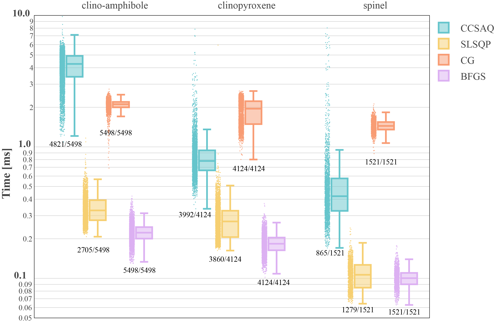

# Thermodynamic Sandbox

Here you can find script(s) dealing with thermodynamic-related problems

## Gradient-Based minimizers

> - Julia scripts used in Riel et al.,( submitted) to use nullspace optimization approach to minimize individual solution phase model.

> #### *unconstrained_CG_BFGS/nullMin.jl*
> 
> - Tests the unconstrainted solution phase formulation using the CG and BFGS methods
> - The scripts include spinel, clinopyroxene and amphibole as formulated in Holland et al., 2018.
> - Gibbs hyperplanes for each phase have been computed using MAGEMin and the igneous database at the following conditions:

    1. 12 kbar and 1100 °C for spinel
    2. 3.26 kbar and 906.25 °C for the spinel solvus test
    3. 12 kbar and 1100 °C for clinopyroxene
    4. 5 kbar and 650 °C for amphibole

> #### *inequality_constrained_CCSAQ_SLSQP/NLopt_call_using_MAGEMin.jl*
>
> - Tests the inequality constrained formulation of the solution phase by calling NLopt through MAGEMin and using the CCSAQ and SLSQP methods
> - The scripts include spinel, clinopyroxene and amphibole as formulated in Holland et al., 2018.
> - Gibbs hyperplanes for each phase have been computed using MAGEMin and the igneous database at the following conditions:

    1. 12 kbar and 1100 °C for spinel
    2. 3.26 kbar and 906.25 °C for the spinel solvus test
    3. 12 kbar and 1100 °C for clinopyroxene
    4. 5 kbar and 650 °C for amphibole



To fully reproduce the results, clone or download this repository and launch Julia in project mode `julia --project` from the folder GradientBasedMinimizers and `instantiate` or `resolve` the dependencies from within the REPL in package mode `julia> ]`.

The scripts can be launched either from the REPL:
```julia-repl
julia> include("GradientBasedMinimizers/NLopt_call_using_MAGEMin.jl")
```
or executed from the shell as:
```shells
julia --project GradientBasedMinimizers/NLopt_call_using_MAGEMin.jl
```

By default, the phase is spinel. To change it to amphibole or clinopyroxene, modify the `ph` variable in the scripts.

## Gibbs free energy minimization

> #### *PhaseEquilibriumMinimizer/MAGEMin_PGE_and_LP.m*
>
> - MATLAB script used in Riel et al., (2022) [Geochemistry, Geophysics, Geosystems, 23, 7] to present a simplified application of MAGEMin minimization approach (including feldspar, quartz and sillimanite) and compare it with linear programming. 
> - The minimization is conducted in the NCKAS chemical system at 0.3 GPa and 873.15 K.
> - The Plagioclase model is taken after Holland et al., 2021
> - The Linear programming approach described in de Capitani & Brown (1987)


